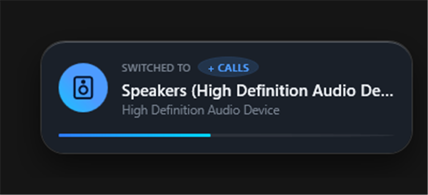
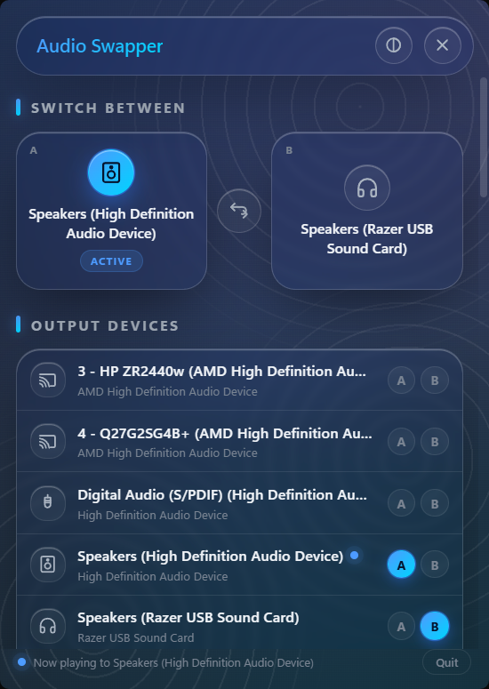
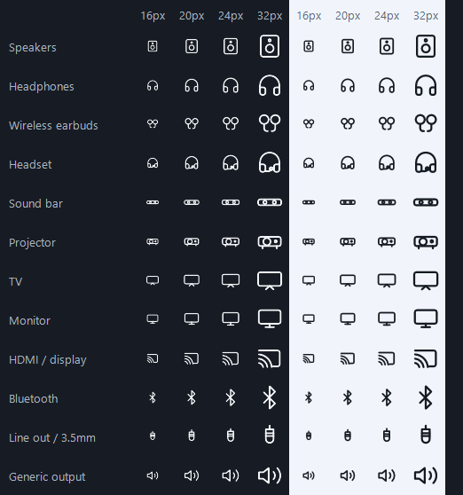

# Audio Swapper

[](https://github.com/EBTEAM3/Audio-Output-Swapper/actions/workflows/ci.yml)
[](https://claude.com/claude-code)
[](LICENSE)

A Windows 11 tray app that flips your default audio output between two devices
with one click, and shows you where the sound went.

No installer, no window, no background service — just a tray icon. Click it and
your audio moves between (say) your speakers and your headset. A popup in the
corner confirms which one you landed on.



<sub>The settings panel, and the twelve device icons at real tray sizes:</sub>

<p>
  
  
</p>

---

## Install

1. Download **`AudioSwapper.exe`** from the
   [latest release](../../releases/latest).
2. Put it wherever you like — `%LOCALAPPDATA%\Programs\AudioSwapper\` is a
   sensible spot.
3. Double-click it. The tray icon appears; nothing else opens.

Nothing else to install. The download bundles everything it needs.

> **Windows will warn you the first time.** The exe isn't code-signed (a
> certificate costs a few hundred dollars a year), so SmartScreen shows
> *"Windows protected your PC"*. Click **More info → Run anyway**. If that
> bothers you, build it yourself — see [Building](#building).

### Making the tray icon always visible

Windows tucks new tray icons into the overflow flyout. To pin it next to the
clock:

**Settings → Personalization → Taskbar → Other system tray icons →** turn
**Audio Swapper** on.

### Uninstall

Quit from the panel's **Quit** button, then delete the exe. If you want every
trace gone:

- `%APPDATA%\AudioSwapper\` — settings
- `%LOCALAPPDATA%\AudioSwapper\` — WebView2 cache for the settings panel
- The `AudioSwapper` value under
  `HKCU\Software\Microsoft\Windows\CurrentVersion\Run`, if you enabled
  *Start with Windows*

---

## Using it

| Action | Result |
|---|---|
| **Left-click** the tray icon | Swaps between your two chosen devices |
| **Right-click** the tray icon | Opens the settings panel |
| **Ctrl+Alt+A** | Swaps from anywhere, including inside a fullscreen game |
| Click any row in the panel | Switches straight to that device |

On first run nothing is paired, so the first click opens the panel. Assign one
device to **A** and another to **B** with the pills on the right of each row,
and the tray icon becomes a toggle between them.

### Command line

Handy for a Stream Deck button, an AutoHotkey binding or a shortcut. If the app
is already running these drive the running instance instead of starting a second
copy.

```bash
AudioSwapper.exe --swap
```

`--swap` toggles A/B · `--menu` opens the panel · `--quit` exits.

---

## Settings

Everything lives in the panel and is saved to
`%APPDATA%\AudioSwapper\config.json`, which is plain JSON and safe to hand-edit
while the app is closed.

| Setting | Default | Notes |
|---|---|---|
| **Also switch calls** | On | Moves the *Communications* role too, so Teams, Discord and Zoom follow. Turn this **off** if you deliberately keep calls on a separate device. |
| **Show popup** | On | The corner confirmation. Failures still show — a click that silently does nothing is worse than an unwanted notification. |
| **Tray shows device** | On | The tray glyph becomes the current device's icon. |
| **Start with Windows** | Off | Adds an `HKCU\...\Run` entry for your account only. Removable from here or Task Manager's Startup tab. |
| **Shortcut** | `Ctrl+Alt+A` | Click the box and press a combination. A modifier is required. |
| **Theme** | Follows Windows | The circle button in the header cycles system → dark → light. |
| `ToastBottomOffset` | 94 | Config-file only. Gap in device-independent pixels between the popup and the bottom of the screen, set high enough to clear media controls and other corner overlays. |

### Device icons

Twelve icons ship: speakers, headphones, wireless earbuds, headset, sound bar,
projector, TV, monitor, HDMI/display, Bluetooth, line out, generic.

Each device gets one guessed automatically — from its name first, falling back to
the form factor Windows reports. Click the icon on any row to change it. The
choice is remembered per device, so it survives unplugging and re-pairing.

---

## Building

Needs the [.NET 10 SDK](https://dotnet.microsoft.com/download/dotnet/10.0) and
Windows 10 build 19041 or newer. The WebView2 Runtime is required for the
settings panel and ships with Windows 11 already.

```bash
git clone https://github.com/EBTEAM3/Audio-Output-Swapper.git
```

Then, from the repo root:

```bash
dotnet build src/AudioSwapper -c Debug
```

To produce the same standalone exe the releases ship:

```bash
powershell -File build.ps1
```

That writes `dist/AudioSwapper.exe` — around 72 MB, with the .NET runtime
bundled so it needs no prerequisites. For a much smaller build that requires the
.NET 10 Desktop Runtime on the target machine, pass `-SelfContained:$false`
(around 26 MB).

### Layout

```
src/AudioSwapper/
  Audio/      MMDevice + IPolicyConfig interop, device service
  Config/     JSON settings
  Interop/    DWM, hotkeys, DPI-correct placement, startup, IPC, memory trim
  Ui/         Native popup, WebView2-hosted panel, icon set, tray renderer
  Web/        glass.css + menu.html (embedded resources)
tools/        Dev scripts and the icon contact-sheet harness
```

### Dev tools

| Script | Purpose |
|---|---|
| `tools/preview.py` | Renders the settings panel standalone with mock data, for design work in a browser |
| `tools/Get-DefaultAudio.ps1` | Prints the current default device per role |
| `tools/Set-DefaultAudio.ps1` | Sets one role — useful for restoring a machine after testing |
| `tools/Get-AppUsage.ps1` | Memory footprint of the app and only its own child processes |
| `tools/Capture-Window.ps1` | Screenshots just the app's windows |
| `tools/IconSheet` | Renders every icon through the real tray pipeline and fails on a bad path |

---

## How it works, and the one caveat

Enumerating devices, reading their names and watching for hotplug all use the
public **MMDevice API** (`IMMDeviceEnumerator`, `IPropertyStore`,
`IMMNotificationClient`).

Changing the default device does not. **Windows exposes no public API for it.**
The only way is `IPolicyConfig`, an undocumented COM interface on the
`PolicyConfigClient` coclass — the same one SoundSwitch, EarTrumpet, AudioSwitcher
and nircmd all use. It has been stable since Vista and works on Windows 11, but
it is not contractual, and a future Windows release could in principle change it.
If that happens the app degrades to a "Windows refused the change" popup rather
than failing silently. See `Audio/PolicyConfig.cs`.

Because the vtable is undocumented, **the declaration order in that interface is
load-bearing** — every method before `SetDefaultEndpoint` must stay declared even
though none are called, or the slot index shifts and you call the wrong function.

### Two things worth knowing if you touch this code

**`PROPVARIANT` is 24 bytes on x64, not 16.** Declaring only the fields you read
gives a 16-byte struct, and `PropVariantInit` inside the property store then
memsets 24 bytes over it. Strings happened to still work; form-factor reads came
back empty. `Audio/ComInterop.cs` pins the size explicitly.

**The interface friendly name is property 6, not 2.** Property 2 in the same set
is the device interface path (`{1}.USB\VID_1532&PID_0529&...`), which reads as a
bug when it lands in the UI.

---

## Footprint, and why the popup is not a web page

The popup started out as a WebView2 page like the settings panel. That meant
every switch booted a Chromium stack and left it resident: **7 processes and
around 670 MB of working set**, for a tray utility whose job is to draw a rounded
box with two lines of text in it.

It is now drawn natively in WPF (`Ui/ToastWindow.xaml`). Measured on a real
machine:

| | Processes | Working set (idle) |
|---|---|---|
| WebView2 popup | 8 | ~670 MB |
| Native popup | 1 | **~3–16 MB** |

Three things get it there:

- **The popup is native.** No browser on the path that runs on every switch. It
  also gets real per-pixel window transparency, so the corners are a proper 22px
  with a soft drop shadow rather than the 8px DWM compromise a WebView2 window is
  stuck with.
- **The panel's WebView2 is disposed 30 seconds after it closes.** Reopening
  inside that window is instant; leaving it alone gives all six browser processes
  back. Reopening after teardown costs a few hundred milliseconds, which is the
  right trade for something opened this rarely.
- **The working set is trimmed** when the popup hides and once after startup.
  Startup touches a lot of pages — JIT, assembly loading, the first icon render —
  that are never read again.

Private *commit* stays around 260 MB, which is WPF's baseline plus reserved GC
segments. That is virtual address space, not resident RAM; it is paged out and
reclaimable, and it is flat across repeated switches (verified over eight
consecutive swaps, with handle and thread counts stable — no leak).

To check it yourself:

```bash
powershell -File tools/Get-AppUsage.ps1
```

That walks the process tree rather than matching on name — plenty of other apps
host WebView2, and counting those would sweep in hundreds of unrelated megabytes.

---

## Windows-specific behaviour handled

- **Mixed DPI.** Windows are placed in physical pixels against the target
  monitor's own DPI (`Interop/ScreenPlacement.cs`), so they anchor correctly on a
  125% panel next to a 100% one.
- **Light and dark taskbars.** The tray glyph is redrawn on `WM_SETTINGCHANGE`
  when the system theme flips, so it never goes white-on-white.
- **The popup never takes focus** (`WS_EX_NOACTIVATE`), so switching mid-game or
  mid-call cannot pull you out of what you were doing.
- **Hotplug bursts are coalesced** — plugging in a headset fires several
  callbacks and produces exactly one refresh.

---

## Built with AI

Written with [Claude Code](https://claude.com/claude-code) and tested on real hardware.

---

## Licence

[MIT](LICENSE).
